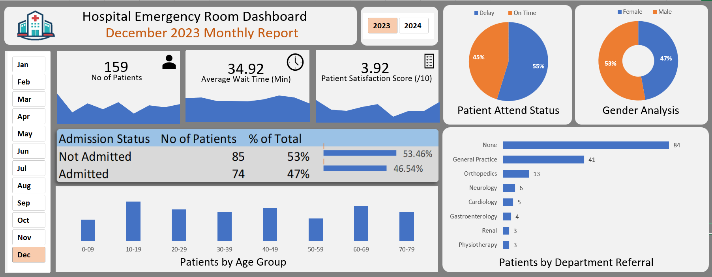

# 🏥 Hospital Emergency Room Dashboard

## 📊 Project Overview

An interactive Excel dashboard designed to analyze Hospital Emergency Room patient data and provide insights into patient volume, waiting time, satisfaction, admission status, attendance, demographics, and department referrals.

The dashboard allows users to interactively filter the analysis by **Year** and **Month** using Excel slicers.

## 🖼️ Dashboard Preview

## 🎯 Key Objectives

- Monitor overall patient volume
- Analyze average patient waiting time
- Track patient satisfaction scores
- Compare admitted vs. non-admitted patients
- Analyze patient attendance status
- Understand gender and age-group distribution
- Identify department referral patterns
- Enable monthly and yearly analysis through interactive slicers

## 📌 Key Performance Indicators

- **Total Patients**
- **Average Wait Time (Minutes)**
- **Patient Satisfaction Score**
- **Admission Status**
- **Patient Attendance Status**

## 📈 Dashboard Features

### Interactive Filters
- Year selection: **2023 / 2024**
- Month selection: **January – December**
- Dynamic monthly report title based on the selected Year and Month

### Visual Analysis
- Patient Attendance Status
- Gender Analysis
- Admission Status
- Patients by Age Group
- Patients by Department Referral
- Patient volume trends

## 🛠️ Tools & Excel Features Used

- Microsoft Excel
- PivotTables
- PivotCharts
- Slicers
- Excel formulas
- Data filtering
- Conditional formatting
- Dashboard design
- Interactive reporting
- Calendar/Date Table

## 💡 Key Insights

The dashboard provides a consolidated view of emergency room operations and helps identify patterns in:

- Patient admissions
- Waiting times
- Patient satisfaction
- Attendance behavior
- Demographic distribution
- Department referral volume

## 📂 Project Files

| File | Description |
|------|-------------|
| `Hospital_Emergency_Room_Dashboard.xlsx` | Interactive Excel dashboard |
| `Dashboard_Preview.png` | Dashboard preview image |

### 📥 Download the Interactive Excel Dashboard

[Download Excel Dashboard](Hospital_Emergency_Room_Dashboard.xlsx)

## 🚀 How to Use

1. Download the Excel dashboard.
2. Open the `.xlsx` file using Microsoft Excel.
3. Go to the **Dashboard** sheet.
4. Use the **Year** and **Month** slicers to filter the dashboard.
5. Observe the KPIs and charts update dynamically.

---

### 📌 Project Status

**Completed — Excel Dashboard Project #1**
